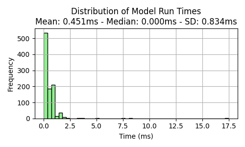
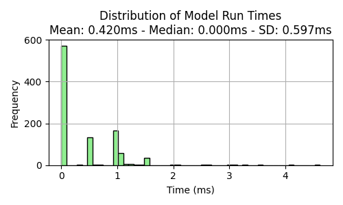

# IoT Telemetry failure and anomaly detection


# 1. Introduction
The dataset selected for this work is the Smart Manufacturing IoT Cloud Monitoring Dataset
- https://www.kaggle.com/datasets/ziya07/smart-manufacturing-iot-cloud-monitoring-dataset

We used this dataset as such machines are similar to any PC components. It contains features such as temperature, vibration, humidity, pressure, and energy consumption, which can represent the real features of a PC component:
- Temperature: 
    - Represents the thermal state of PC components like CPU and GPU. 
    - Elevated, fluctuating, or sustained high temps often hint at cooling interface degradation or increased workload—just as in IoT systems, abnormal temperature readings indicate equipment stress or failure 

- Vibration: 
    - In PCs, fan vibration or hard-drive spin irregularities act like mechanical failure indicators—mirroring industrial settings where vibration spikes reveal mechanical faults in motors or structures.

- Humidity: 
    - While PCs are kept in controlled environments, ambient humidity still affects internal corrosion risk and electrical stability—just like environmental IoT sensor systems highlight humidity’s impact on electronic device reliability.

- Pressure: 
    - Though PCs don’t have internal pressure sensors, this can stand in for PSU voltage fluctuations or airflow pressure changes. 
    - In industrial IoT, pressure sensors track fluid or airflow—changes often signal blockages or system degradation.

- Energy consumption: 
    - Maps directly to PC power draw, reflecting CPU/GPU workloads or inefficiencies—exist in IoT energy‐monitoring systems where spikes can signal abnormal component behavior .


# 2. Explorary Data Analysis
```bash
1_main_EDA.ipynb
```
- Load data
    - We realized the number of anomal labels is significant (~10%) of all data; a ratio of 1:9.
    - To make the data more realistic to a real anomaly detection project, we removed 95% of the anomal data, keeping only 5%, making the ratio closer to a 1:200.
    - For this project, we only look at 5 features, namely the temperature, vibration, humidity, pressure, and energy consumption. Meanwhile, the label is the "anomaly_flag"
- Plot histogram and boxplot to illustrate feature distribution
- Plot time-series to senosr data
- Plot feature correlation matrix and pairplot


# 3. Modeling with Light GBM
```bash
2_main_modelling_lgbm.ipynb
```
Part 1: Modeling
- Load data
- Split data by machines: training (machine 1-40) and testing (machine 41-50)
- Scale data using standard scaler (normalization)
- Train LightGBM classifier via gridsearch
- Determine feature importance (pressure, vibration, humidity, temperature)
- Evaluation metrics (confusion matrix, precision, recall, f1 score, AUC)
- Reduce number of features from 5 to 2
- Save models
- Compute time for inference

Part 2: Modeling Optimization
- Same as Part 1, but with some changes
    - Removed "energy_consumption" as features as it is the lowest rank in feature importance
    - Change gridsearch parameters to much smaller (e.g. num_leaves 5-10 instead of 15-30) to make the model smaller

Part 3: Results comparison:
- In Part 1
    - The confusion matrix:

        

    - When normalized:

        

    - Meanwhile, the time required to compute 1 inference is:

        

- In Part 2
    - The confusion matrix:

        

    - When normalized:

        

    - Meanwhile, the time required to compute 1 inference is:

        

- Interestingly enough, the smaller model performs better in terms of anomaly detection, but take around 0.15ms longer per inference. This is highly within the margin of error as it is within both the standard deviation


# 3. Modeling with Neural Network (NN) and ONNX
```bash
3_main_modelling_nn.ipynb
```
- Same as earlier, but with some changes
    - Change model into a neural network
    - The confusion matrix:

        

    - When normalized:

        

    - Meanwhile, the time required to compute 1 inference is:

        

- Next, we export the model into a onnx format
    - The confusion matrix:

        

    - When normalized:

        

    - Meanwhile, the time required to compute 1 inference is:

        