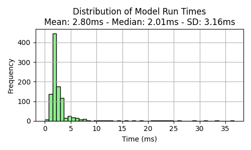
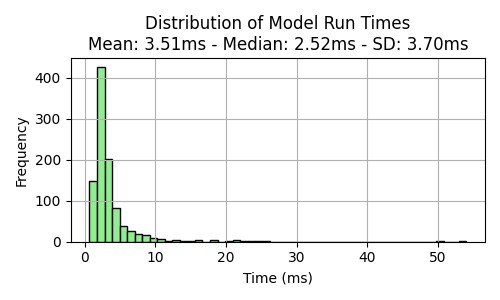

# IoT Telemetry failure and anomaly detection

# 1. Introduction
The dataset selected for this work is the Smart Manufacturing IoT Cloud Monitoring Dataset
- https://www.kaggle.com/datasets/ziya07/smart-manufacturing-iot-cloud-monitoring-dataset

We used this dataset as such machines are like any PC components. It contains features such as temperature, vibration, humidity, pressure, and energy consumption, which can represent the real features of a PC component:
- Temperature: 
    - Represents the thermal state of PC components like CPU and GPU. 
    - Elevated, fluctuating, or sustained high temperatures often hint at cooling interface degradation or increased workload just as in IoT systems, abnormal temperature readings indicate equipment stress or failure 

- Vibration: 
    - In PCs, fan vibration or hard-drive spin irregularities act like mechanical failure indicators, mirroring industrial settings where vibration spikes reveal mechanical faults in motors or structures.

- Humidity: 
    - While PCs are kept in controlled environments, ambient humidity still affects internal corrosion risk and electrical stability, just like environmental IoT sensor systems highlight humidity’s impact on electronic device reliability.

- Pressure: 
    - Though PCs do not have internal pressure sensors, this can stand in for PSU voltage fluctuations or airflow pressure changes. 
    - In industrial IoT, pressure sensors track fluid or airflow, and changes often signal blockages or system degradation.

- Energy consumption: 
    - Maps directly to PC power draw, reflecting CPU/GPU workloads or inefficiencies in IoT energy‐monitoring systems where spikes can signal abnormal component behaviour.

# 2. Exploratory Data Analysis
```bash
1_main_EDA.ipynb
```
- Load data
    - We realized the number of anomaly labels is significant (~10%) of all data; a ratio of 1:9.
    - To make the data more realistic to a real anomaly detection project, we removed 95% of the anomaly data, keeping only 5%, making the ratio closer to a 1:200.
    - For this project, we only look at 5 features, namely the temperature, vibration, humidity, pressure, and energy consumption. Meanwhile, the label is the "anomaly_flag"
- Plot histogram and boxplot to illustrate feature distribution
- Plot time-series to sensor data
- Plot feature correlation matrix and pair plot

- From the data, it appears that when the machine has anomaly high temperature and vibration, it is an outlier and anomaly, and should be flagged

# 3. Modelling with Light GBM
```bash
2_main_modelling_lgbm.ipynb
```
We choose the Light Gradient Boosting Model (LGBM) as it is small and light weight, while being accurate enough as compared to the more popular XGBoost.

Part 1: Modelling
- Load data
- Split data by machines: training (machine 1-40) and testing (machine 41-50)
- Scale data using standard scaler (normalization)
- Train LightGBM classifier via grid search
- Determine feature importance (pressure, vibration, humidity, temperature)
- Evaluation metrics (confusion matrix, precision, recall, f1 score, AUC)
- Reduce number of features from 5 to 2
- Save models
- Compute time for inference

Part 2: modelling Optimization
- Same as Part 1, but with some changes
    - Removed "energy_consumption" as features as it is the lowest rank in feature importance
    - Change grid search parameters to much smaller (e.g. num_leaves 5-10 instead of 15-30) to make the model smaller

Part 3: Results comparison:
- In Part 1
    - Performance and CM:

        

    - Meanwhile, the time required to compute one inference is:

        

- In Part 2
    - Performance and CM normalized:

        

    - Meanwhile, the time required to compute one inference is:

        

- Comparing the results between the PyTorch and ONNX model
    - LGBM model obtained an F1 score of 0.63, and the mean time for inference is 2.41ms.
    - Smaller LGBM model obtained an F1 score of 0.65, and the mean time for inference is 2.82ms.
    - The performance somehow improved slightly, while the inference speed reduced by increased.
    - This is highly within the margin of error as it is within both the standard deviation


# 3. modelling with Neural Network (NN) and ONNX
```bash
3_main_modelling_nn.ipynb
```
- Same as earlier, but with some changes
    - Change model into a neural network
    - Performance and CM:

        

    - Meanwhile, the time required to compute one inference is:

        

- Next, we export the model into a onnx format
    - Performance and CM normalized:

        

    - Meanwhile, the time required to compute one inference is:

        

- Comparing the results between the PyTorch and ONNX model
    - PyTorch model obtained an F1 score of 0.83, and the mean time for inference is 0.157ms.
    - ONNX model obtained an F1 score of 0.85, and the mean time for inference is 0.226ms.
    - The performance somehow improved, while the inference speed also increased by reduced by ~30%.

# 4. Discussion

| Model             | PRE      | REC      | F1       | Inference Time (ms) |
| :---------------- | :------: | :------: | :------: | -------------------:|
| LGBM              |  0.47    |  0.97    |  0.63    | 2.41                |
| LGBM Small        |  0.48    |  1.00    |  0.65    | 2.82                |
| NN PyTorch        |  0.72    |  0.99    |  0.83    | 0.157               |
| NN ONNX           |  0.79    |  0.92    |  0.85    | 0.226               |

## Performance and Speed
- Comparing the LGBM model and the NN model, the NN model is more accurate and significantly faster (10x times faster)
- Additionally, the performance of the NN model is much better: 0.83-0.85 vs 0.63-0.65
- Due to this, the NN model is always the better model
## Model Size
- Comparing the model size, the LGBM model is 72kB while the smaller LGBM model is 23kB.
- Interesting enough, the NN model is 5kB before and after quantization, which is significantly smaller than the LGBM model
## Conclusion
- All in all, the NN model is better as it is much more accurate and smaller than the LGBM model.
- Additionally, as the model is very small, it is possible for it to be deployed on edge devices.

# 5. Model Integration on a PC (Edge Deployment Scenario)

## Strategy

- To deploy this anomaly detection model on PCs in production, the model would be integrated into a lightweight background service that continuously monitors telemetry data (e.g. CPU load, temperature, memory usage, SMART disk health).
- Model is in ONNX format and quantized (QInt8) to reduce size and inference latency.
- Model would run using ONNX Runtime, which supports efficient inference on Windows with low CPU overhead.
- A small agent (Python or C++) runs in the background as a Windows service.
- The agent will periodically collects telemetry data, preprocess them, and passed to the model for inference.
- If an anomaly is detected (e.g. probability > 0.5), the service logs it or triggers a local alert.

## Requirements
- Python 3.11 is installed.
- Required libraries: onnxruntime, numpy, scikit-learn (for evaluation), torch, etc
- The PC has basic telemetry access (e.g. WMI for Windows system data).

## Production
- The model would be converted to a C++ executable or embedded in a C++ agent using ONNX Runtime C++ API.
- The agent would be packaged with SupportAssist or fleet management software and run with minimal system impact.
- Libraries would be bundled, and the model file (~4KB quantized) would reside locally.
- Logging, alerting, or optional secure transmission to cloud analytics may be added.

## Resources impact:
- Model size: ~3.5 KB (quantized ONNX)
- Inference time: <1ms per sample on standard Intel Core i5 PC
- CPU overhead: Negligible (single-threaded, vectorized inference)
- Memory usage: Minimal (<5MB for model and input buffers)

